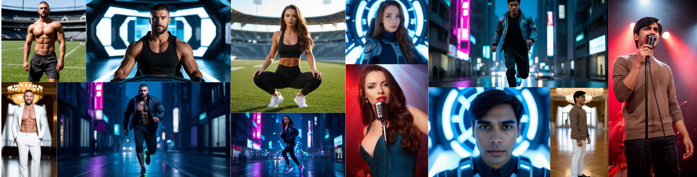

# SimpleTuner Playground – HiDream

**SimpleTuner Playground** is designed for fast experimentation and benchmarking.  
This is a fork of **SimpleTuner**, edited to reduce configuration overhead. Tested with **HiDream**.


## 🎨 Character Results




## 🛠️ Setup

```bash
git clone --branch=release https://github.com/omrastogi/SimpleTuner.git
cd SimpleTuner

# Create and activate environment
conda create -n smpltnr python=3.11 -y
conda activate smpltnr

# Install poetry and other essential packages
pip install -U poetry pip 
pip install autoroot autorootcwd gradio

# Prevent Poetry from using its own venv
poetry config virtualenvs.create false
```

```bash
# Choose based on your system

# MacOS
poetry install -C install/apple

# Linux
poetry install

# Linux with ROCm
poetry install -C install/rocm
```

---

## ⚡ Optional: FlashAttention (Recommended)

```bash
git clone https://github.com/Dao-AILab/flash-attention
cd flash-attention/hopper
python setup.py install
```

---

## 🎯 Training

1. Prepare your config in `preconfig/<job_id>.yaml`:

```yaml
job_id: marlowe
folder_path: "/mnt/data/Marlowe"
pretrained_model_name_or_path: "HiDream-ai/HiDream-I1-Dev"
adapter_prompt: "MarloweFemale, young woman with almond-shaped eyes, softly contoured high cheekbones, a delicate straight nose, full natural lips, heart-shaped face, and a smooth jawline with gentle definition."
val_prompt: "posing confidently in a cozy reading nook by a tall bookshelf, warm ambient lighting, casual attire"
prompt_file: "/mnt/data/test_prompts.txt"
output_base_dir: "output/characters/"
factor: 64
algo: lora
linear_alpha: 1.0
multiplier: 1.0
max_train_steps: 3000
learning_rate: 1e-4
```

2. Run training:

```bash
CUDA_VISIBLE_DEVICES=0 python run_training.py preconfig/marlowe.yaml
```

---

## 🧪 Inference (Scripted)

```bash
python scripts/infer_hidream_lora.py \
  --adapter_path output/characters/marlowe/pytorch_lora_weights.safetensors \
  --prompt "MarloweFemale, young woman with almond-shaped eyes, softly contoured high cheekbones, a delicate straight nose, full natural lips, heart-shaped face, and a smooth jawline with gentle definition." \
  --guidance_scale 4.5 \
  --negative_prompt "bad anatomy, bad proportions, malformed limbs, extra limbs, missing fingers, mutated hands, deformed face, poorly drawn face, blurry eyes, disfigured features, unnatural expression, lowres, blurry, pixelated, watermark, logo, unnatural skin tone, glitch, artifact, noise, distortion, ugly" \
  --output_dir generations/marlowe
```

> ✅ You can also use a `--prompt_file` for batched inference:
```bash
--prompt_file /mnt/data/dataset/test_prompt.txt
```

---

## 🎨 Playground (Interactive UI)

```bash
python scripts/lora_playground_app.py --adapter_folder output/characters
```
